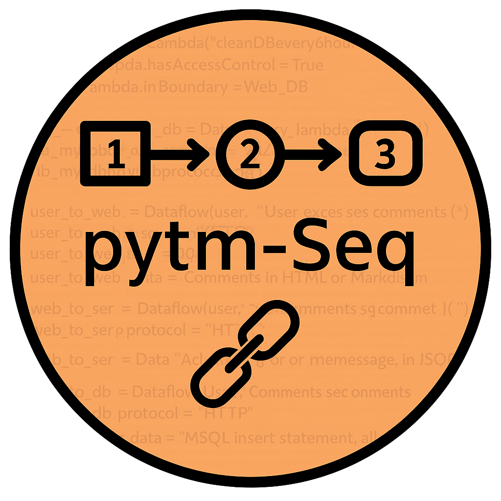

# pytm-Seq

**Extending OWASP pytm for Multi-Step Attack Detection with Sequence-Labeled Data Flow Diagrams**

---

## Overview

As software systems grow in complexity, cyberattacks are increasingly exploiting **combinations of multiple vulnerabilities** rather than a single weakness. Existing threat modeling tools often focus only on individual components, making it difficult to detect **chained, multi-step attacks** that depend on execution order.

**pytm-Seq** is an extended version of [OWASP pytm](https://github.com/OWASP/pytm) that introduces:
- **Sequence-labeled Data Flow Diagrams (DFDs)**  
- **Function type attributes for processes**  
- A **pattern-matching algorithm** for multi-step attack detection  

With these extensions, pytm-Seq can automatically detect attacks that exploit specific **execution orders** and **functional interactions** between system components.

---

## Features

- ✅ Extended DFD metamodel with **order** and **function type** attributes  
- ✅ Formalisation of **multi-step attack patterns** (e.g., TOCTOU, Oracle Manipulation) in JSON  
- ✅ Automated detection of subgraphs in DFDs that match multi-step patterns  
- ✅ HTML reports summarising identified threats and attack scenarios  
- ✅ Case-study validation with **52 real-world multi-step attacks**, deriving **5 representative patterns**

---

## 🏗️ Technical Architecture and Core Components

The extended functionality is integrated into the base $\text{pytm}$ framework.

### 1. Threat Identification Engines and Code

- **`pytm` Core:** Contains the original single-element threat identification engine and the overall framework code.
    - **`extensions_mod.py`:** The **pytm-Seq Multi-Step Plugin**. This file holds the custom implementation for the new **multi-step threat identification engine**, including the order-based DFD analysis algorithm.

### 2. Threat Pattern Library (`threatlib`)

This directory is the knowledge base, defining all recognizable threat patterns as JSON code.

- **`threats.json`:** Defines the **single-element unit threats** that the original $\text{pytm}$ is capable of identifying.
- **`scenarios.json`:** Defines the formalized **multi-step attack patterns** (scenarios) with sequence and function type constraints.

### 3. Case Study Validation Artifacts

These files are essential outputs from the case study presented in the related ICISC paper.

- **`DFD_case_study.png`:** The Data Flow Diagram model created for the case study (Corresponds to **Fig. 6** of the paper).
- **`report_case_study.html`:** The generated threat analysis report, demonstrating the successful identification of the complex multi-step attack pattern (Corresponds to **Fig. 7** of the paper).

---


## 📦 Installation

We highly recommend using the provided Docker setup for a consistent and isolated environment, ensuring all dependencies are correctly managed.

### Using Docker (Recommended for Isolated Testing)
+ 1. Build the Docker image
     ```docker build --no-cache -t new_pytm:0.0 .```
+ 2. Run the container
     ```docker run -it --name pytm-test new_pytm:0.0```

## ⚙️ Usage Instructions

The core functionality of multi-step attack detection is controlled by a single parameter in the primary processing function.

The mode parameter on the TM object's process call indicates whether to enable the multi-step detection engine.

+ 1. Defining the System Model and Execution (sample_dfd.py) : Define your system's DFD in a Python file. Ensure to use the order and function_type attributes for data flows and processes that define sequence and function type, respectively.
  
```
from pytm.pytm import TM
# Initialize the Threat Model object
tm = TM("my test tm")
## ... (DFD Declaration Code here)
## Example: process.function_type = "Write", data_flow.order = 1
# Start Threat and Multi-step Threat Identification
# Setting mode=1 activates the multi-step attack detection engine.
tm.process(mode=1)
```

+ 2. After writing your DFD code (e.g., in sample_dfd.py), execute the following commands in your bash environment to generate the outputs. Generate Multi-step Threat Identification Report (tm_report.html)

This command executes the DFD code, generates the report, and converts the markdown output to a final HTML document.

```./sample_dfd.py --report docs/basic_template.md | pandoc -f markdown -t html > tm/tm_report.html```

 This command generates the DFD in dot format and uses the dot tool (Graphviz) to convert it into a static PNG image.

```./sample_dfd.py --dfd | dot -Tpng -o sample_dfd.png```
