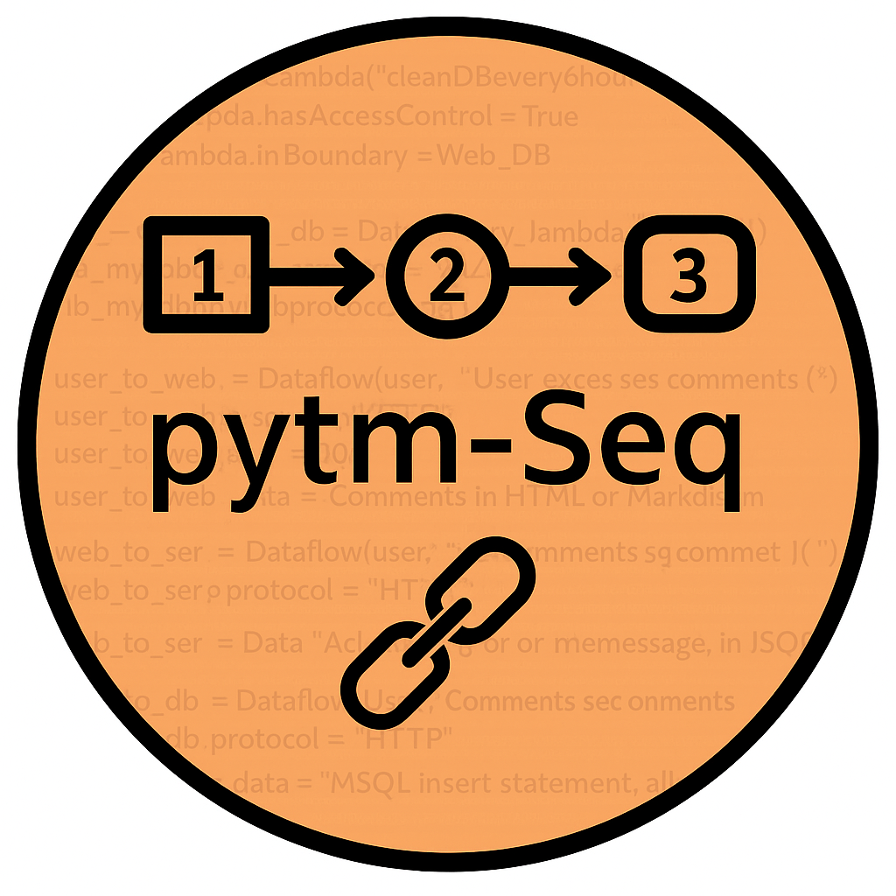
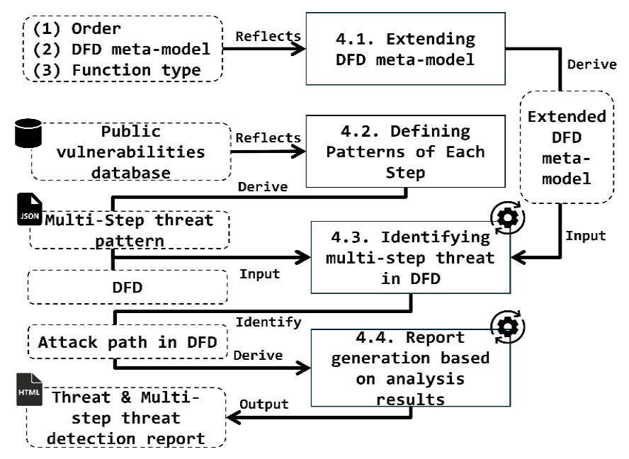

<p align="center"> 
  <!-- tool logo -->
  
</p>

<div align="center">

  <h1 align="center">pytm-Seq</h1>

  <p align="center">
    <a href="https://www.python.org/">
      
    </a>
    <a href="https://github.com/sinse100/pytm-Seq/">
      
    </a>
    <a href="https://graphviz.org/">
      
    </a>
    <a href="https://owasp.org/www-project-ontology-driven-threat-modeling-framework/">
      
    </a>
  </p>
<br><b>ThreatCraft</b> is an automated attack scenario generation tool that combines rule-based reasoning with large language models to produce structurally valid and realistic attack scenarios while reducing expert dependency, inconsistency, and hallucinated outputs.
<br/>

<br>
<h3 align="center">##Demo Video</h3>
<p align="center">
  <a href="https://youtu.be/nrIHEKDLp2E">
    
  </a>
</p>


</br>
</div>

<!-- TABLE OF CONTENTS -->
<h2 id="table-of-contents"> :book: Table of Contents</h2>

<details open="open">
  <summary>Table of Contents</summary>
  <ol>
    <li><a href="#overview"> ➤ Overview</a></li>
    <li><a href="#project-files-description"> ➤ Project Files Description</a></li>
    <li><a href="#installation"> ➤ Installation</a></li>
    <li><a href="#usage-example"> ➤ Usage Example </a></li>
  </ol>
</details>


<!-- OVERVIEW -->
<h2 id="overview"> :compass: Overview</h2>



<!--  -->


<p align="justify">

As software systems grow in complexity, cyberattacks are increasingly exploiting **combinations of multiple vulnerabilities** rather than a single weakness. Existing threat modeling tools often focus only on individual components, making it difficult to detect **chained, multi-step attacks** that depend on execution order.

**pytm-Seq** is an extended version of [OWASP pytm](https://github.com/OWASP/pytm) that introduces:
- **Sequence-labeled Data Flow Diagrams (DFDs)**  
- **Function type attributes for processes**  
- A **pattern-matching algorithm** for multi-step attack detection  

With these extensions, pytm-Seq can automatically detect attacks that exploit specific **execution orders** and **functional interactions** between system components.

</p>

---

### 🔁 1. DFD Metamodel Extension Layer

<p align="justify">

The first stage extends the OWASP ODTM DFD metamodel with additional information required for multi-step attack detection.


</p>

+ 📌 DataFlow Order Represents the sequence of data transfers.
+ 📌 Process Function Type Represents the semantic role of a process.
  + Examples:
    + Read
    + Write
    + Flash Loan
    + Asset Exchange
    + Price Oracle

→ Output: Extended DFD Metamodel


---

### 🧩 2. Multi-Step Threat Pattern Definition Layer

<p align="justify">
Real-world attack cases, vulnerability databases, and threat intelligence sources are analysed to derive reusable attack patterns.
</p>

+ 📌 MITRE ATT&CK
+ 📌 Real-world attack incidents Post-Mortem Report

→ Output: JSON-based Multi-Step Threat Patterns
  
---

### 🔍 3. Attack Path Identification Layer 

<p align="justify">
The attack identification engine traverses the DFD graph while enforcing order constraints and function-type matching rules.

</p>

+ 📌 Starting Node Identification
+ 📌 Ordered Graph Traversal
+ 📌 Sequence Verification
+ 📌 Threat Pattern Matching

→ Output: Attack Path in DFD

---

### 📊 4. Report Generation Layer

<p align="justify">

Detected attack paths are automatically transformed into threat analysis reports.
</p>

+ 📌 Multi-Step Threat Report
+ 📌 HTML Output
+ 📌 Attack Path Summary

→ Output: Threat Analysis Report


<!-- OVERVIEW -->
<h2 id="project-files-description"> :file_folder: Project Files Description</h2>

```bash
pytm-Seq/
│
├── pytm/          ##  source code for pytm-Seq
|   ├── 。。。
|   ├── threatlib/    
│   │   ├── threats.json     ## threat pattern for static threat
│   │   └── scenarios.json   ## threat pattern for multi-step threat
│   ├── pytm.py              ## pytm-Seq core backend engine
│   ├── extensions_mod.py    ## core extension for pytm-Seq (code for sequential analysis)
│   └── templates/           ## template for Threat Detection Report
│
├── docs/                    ## template for threat detection report
│   ├── ...
│   ├── pytm                 ## html template for threat detection report 
│   │   ├── index.html    
│   │   └── report_util.html  
│   └── basic_template.md    ## markdown template for threat detection report
│
├── casestudy
│   ├── ICS               ## artifact for ICS case study 
│   └── smart_contract    ## artifact for Smartr Contract case study
└── Dockerfile            ## Dockerfile to build pytm-Seq

eport_case_study.html │ └── attack_path.json │ └── Dockerfile
```


<!-- OVERVIEW -->
<h2 id="installation"> :gear: Installation</h2>

<p align="justify">
  Follow the steps below to set up and run <b>ThreatCraft</b> in your local environment.
</p>

<ol>
  <li>
    <b>Install Graphviz</b><br/>
    Download and install Graphviz from the official site:<br/>
    https://graphviz.org/download/<br/><br/>
    After installation, make sure to add Graphviz to your system <b>PATH</b> (required for rendering attack graphs).
  </li>

  <li>
    <b>Install Python dependencies</b><br/>
    Run the following command in your project environment:
    <pre><code>pip install graphviz pillow</code></pre>
  </li>

  <li>
    <b>Verify backend prerequisites</b><br/>
    Ensure Python version is <b>3.10+</b> and Graphviz is accessible from the terminal:
    <pre><code>dot -V</code></pre>
  </li>

  <li>
    <b>Run ThreatCraft</b><br/>
    Navigate to the frontend directory and execute:
    <pre><code>cd code/frontend
python tool_attack_paths.py</code></pre>
  </li>
</ol>

<p align="justify">
  Once executed successfully, the system will launch the ThreatCraft and the GUI will be displayed on your screen.
</p>


<!-- OVERVIEW -->
<h2 id="usage-example"> :rocket: Usage Example</h2>

### 🎯 Scenario Definition: Remote Attack on Vehicle Door System

We assume an attacker attempting to remotely compromise a vehicle door control system.

- **Target Asset**: `Door`
- **Trust Boundary**: `External Vehicle Boundary`
- **Attack Mode**: `Remote`


---
### **0. Select The Target Domain To Be Analysed**

Select the target domain for the system under analysis. In this tutorial, the attack scenario targets a vehicle, so choose the Automotive Vehicle domain.


---

### **1. Launch ThreatCraft & Configure Analysis Context**

After starting the application, the GUI dashboard is displayed.

Configure the analysis environment as follows:

- 📂 **DFD File Selection**  
  Load the target system model (`TM7 file`) representing the vehicle architecture.

- 🧠 **LLM Configuration**  
  - Select LLM backend (e.g., GPT-based model)
  - Input valid API key

- 🎯 **Target Definition**
  - Select **Target Asset**: `Door`

- 🌐 **Trust Boundary Selection**
  - Define system boundary: `External Vehicle Boundary`

- ⚔️ **Attack Mode**
  - Set attacker capability: `Remote`

- ▶️ Click **`Run Analysis`**

> 📌 Note: All required threat intelligence libraries (CVE/CWE/EMB3D mappings, dependency graphs, risk models) are preloaded via *Library File Settings* by default.


---

### **2. Configure Implementation Detail of Assets**

Next, we define the implementation details for each asset. 

For instance, as shown in the figure below a TCU may run a Linux operating system with multiple implementation characteristics:
- loadable kernel modules (PID-23L1) and
- Linux namespace isolation (PID-23L2). 

After adding the implementation details to the assets, click “OK”.

> 📌 Note: It is not mandatory to provide implementation details for all assets.
 


---

### **3. Check the Analysis Result**

The result window consists of three tabs:

---

#### **1) Asset Mapping**
Each CWE threat is mapped to a specific asset. Note that CWE entries for an asset are not provided by default; they become available only after defining the asset’s implementation details, as described in Subsection 2 (“Configure Implementation Details of Assets”).


---

#### **2) Attack Paths**
Each identified attack path is summarised. Each path represents a unique combination of assets and threats.


---

#### **3) AI Analysis**
The AI analysis is divided into two levels:

---

##### **Vehicle-Level Review**
For each attack path, the tool assesses its likelihood (confidence level) and provides mitigation recommendations. Furthermore, it performs a comprehensive evaluation across all attack paths to identify and present the highest-risk path.


---

##### **Functional-Level Review**
The tool evaluates the most critical vulnerabilities within each asset in the aggregated attack tree from an SFOP (Safety, Financial, Operational, Privacy) perspective, and presents the results for each asset-specific vulnerability accordingly.


> 📌 Note: You could save its results into JSON, CSV respectively, and also, you can check this whole results displayed in TARA Report(check ```example/_ag_tmp_184849195185.html```)


  


